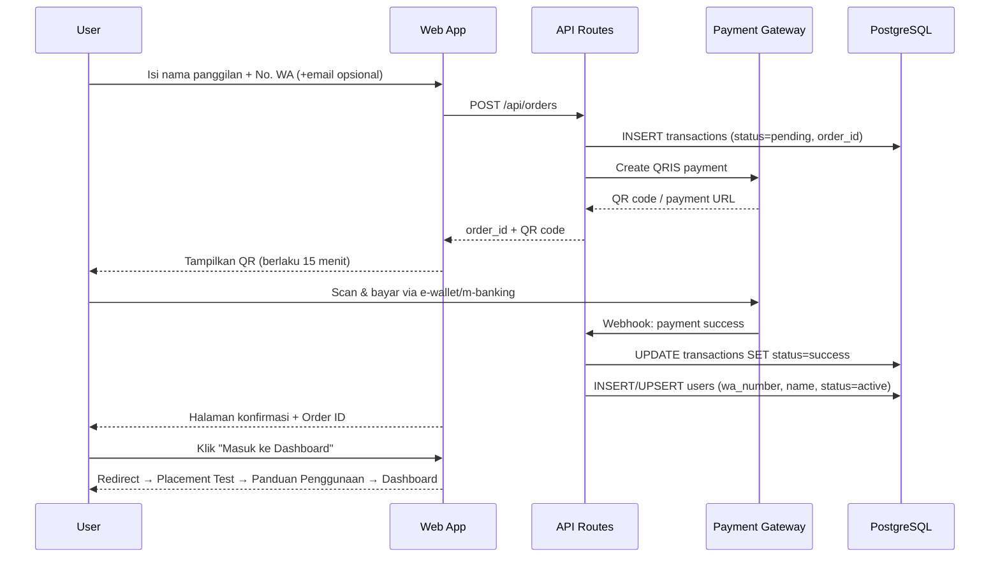
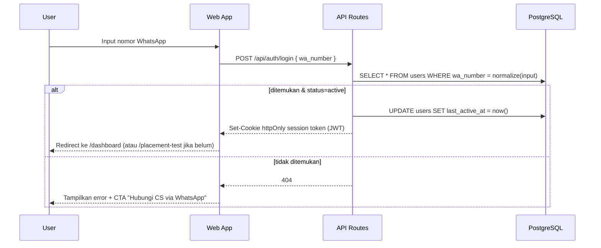
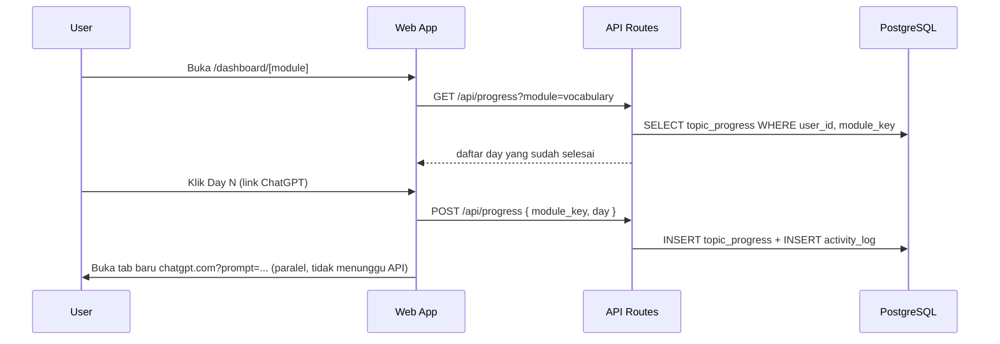
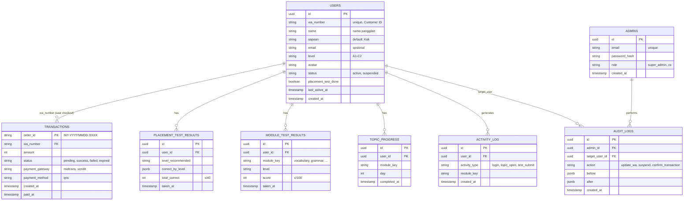
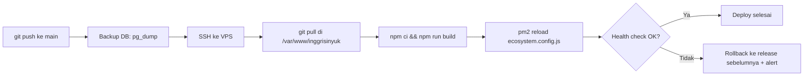

# Architecture — Inggrisin Yuk

> Dokumen ini mendeskripsikan arsitektur **target produksi** untuk Inggrisin Yuk, disusun dari hasil analisis kode di [inggrisinyuk-app/](inggrisinyuk-app/) (kondisi saat ini: prototype frontend) digabung dengan requirement di [prd_user.md](prd_user.md) dan [prd_admin.md](prd_admin.md). Rule operasional turunan dari dokumen ini ada di [CLAUDE.md](CLAUDE.md).

## Daftar Isi

1. [Overview](#1-overview)
2. [Status Implementasi: Sekarang vs Target](#2-status-implementasi-sekarang-vs-target)
3. [Diagram Arsitektur High-Level](#3-diagram-arsitektur-high-level)
4. [Penjelasan Diagram & Komponen](#4-penjelasan-diagram--komponen)
5. [Alur End-to-End](#5-alur-end-to-end)
6. [Desain Database](#6-desain-database)
7. [Desain API](#7-desain-api)
8. [Auth & Security](#8-auth--security)
9. [Arsitektur Deployment (VPS)](#9-arsitektur-deployment-vps)
10. [Tech Stack](#10-tech-stack)
11. [Non-Functional Requirements](#11-non-functional-requirements)
12. [Observability & Backup](#12-observability--backup)
13. [Gap & Tech Debt yang Harus Dibereskan](#13-gap--tech-debt-yang-harus-dibereskan)
14. [Roadmap Arsitektur (Iterasi 2)](#14-roadmap-arsitektur-iterasi-2)

---

## 1. Overview

Inggrisin Yuk adalah platform belajar Bahasa Inggris berbasis **prompt-delivery**: aplikasi web ini *tidak* menjalankan AI inference sendiri. User memilih modul → level CEFR → topik, lalu diarahkan (link `chatgpt.com/?prompt=...`) ke ChatGPT dengan prompt yang sudah dipersonalisasi (nama, sapaan, level). Sesi belajar sesungguhnya terjadi di ChatGPT, di luar platform kita.

Implikasi ke arsitektur:

- **Backend ringan** — tidak perlu infrastruktur AI/LLM sendiri, tidak perlu menyimpan isi percakapan. Yang perlu disimpan: identitas user, status pembayaran, dan progress/score yang **dilaporkan sendiri oleh user** (klik "tandai selesai", hasil placement test, hasil Day-31 test).
- **Login passwordless** — kunci akses adalah nomor WhatsApp yang didaftarkan saat checkout. Bukan WhatsApp Business API (tidak ada OTP/pesan otomatis ke WA), hanya nomor sebagai *Customer ID* yang dicocokkan ke database.
- **Monetisasi sederhana** — flat **Rp 99.900 sekali bayar, lifetime access** (lihat §13 untuk catatan inkonsistensi harga antar dokumen), dibayar via QRIS (Midtrans/Xendit).
- **Dua frontend, satu backend** — aplikasi user (`inggrisinyuk-app`) dan admin panel (CS/Super Admin, di `admin.inggrisinyuk.ai`) berbagi backend & database yang sama, sesuai prd_admin.md §5.
- **Deploy di VPS** (Hostinger — ditandai oleh `hostinger-recovery-codes.txt` di repo), bukan platform serverless seperti Vercel.

---

## 2. Status Implementasi: Sekarang vs Target

| Area | Sekarang (kode di `inggrisinyuk-app`) | Target (dokumen ini) |
|---|---|---|
| Login | ✅ **Selesai** — `/api/auth/login` cek `users.waNumber` (dinormalisasi) di PostgreSQL, `REGISTERED_NUMBERS` hardcoded sudah dihapus | Endpoint `/api/auth/login` cek `users.wa_number` di PostgreSQL |
| Session | ✅ **Selesai** — httpOnly cookie `iy_session` berisi JWT (`lib/session.ts`, pakai `jose`), divalidasi server di setiap request (`getSessionUserId()`) | httpOnly cookie berisi session token (JWT), divalidasi server di setiap request berikutnya |
| Payment | Belum — `checkout-form.tsx` masih simulasi `setTimeout` 1.2s, Order ID di-generate di client (`Math.random()`) | Integrasi nyata Midtrans/Xendit Snap QRIS + webhook konfirmasi server-side |
| Placement test score | ✅ **Selesai** — jawaban mentah dikirim ke `/api/placement-test`, **server menghitung ulang** skor (tidak percaya angka client) & simpan ke `placement_test_results` + update `users` | Dihitung di client (boleh tetap, ringan), **dikirim & disimpan** ke tabel `placement_test_results` via API |
| Edit Profil | ✅ **Selesai** — `PATCH /api/me` menulis sapaan/panggilan/level/avatar ke `users` | (ditambahkan ke scope saat implementasi, lihat di atas) |
| Progress topik per modul | Belum — `completedSet` = `useState<Set<number>>` di `app/dashboard/[module]/page.tsx` — **masih hilang setiap refresh halaman** | Tabel `topic_progress`, ditulis saat user klik link ChatGPT, dibaca saat render halaman modul |
| Streak counter | Belum — hardcoded `streakDays = 2` di `dashboard/page.tsx` | Dihitung dari `activity_log` (tanggal-tanggal distinct user beraktivitas) |
| Admin panel | ✅ **Selesai (User Management saja)** — route group `app/admin/(protected)`, login `/admin/login`, RBAC `super_admin`/`cs` via `lib/require-admin.ts`. User Management penuh (search/filter, detail, edit WA, suspend) + Audit Log (super_admin only). Dashboard & Transaction Management **belum dibangun** — menunggu tabel `transactions` (payment masih simulasi) | Next.js app terpisah/route group `/admin`, RBAC Super Admin & CS, lihat §7 |
| Database | ✅ **Selesai (lokal)** — PostgreSQL native via Homebrew, Prisma (`prisma/schema.prisma`), model `User` + `PlacementTestResult`. Provisioning native di VPS belum dilakukan | PostgreSQL, schema di §6 |
| Materi prompt (BOW, Writing/Speaking Challenge) | ✅ **Selesai untuk A1, A2, B1** (Day 1–30 masing-masing) — `lib/materi/vocabulary-{a1,a2,b1}.ts`, di-route lewat `VOCAB_DAYS_BY_LEVEL` di `app/dashboard/[module]/page.tsx`. B2/C1/C2 Vocabulary & modul lain belum dibangun | **Keputusan final**: tetap file data terstruktur (TS modules), bukan tabel database — lihat §6.3. Tinggal di-scale ke level/modul tersisa |
| Hosting | Belum di-deploy (analytics masih `@vercel/analytics`, mengindikasikan asumsi awal Vercel) | VPS Hostinger, Nginx + PM2, lihat §9 |

**Catatan implementasi (2026-06-23):** Login, session, placement test, dan edit profil sudah database-backed — lihat kode di `app/api/auth/*`, `app/api/me`, `app/api/placement-test`, dan `lib/db.ts`/`lib/session.ts`. Prisma 7 mengubah cara koneksi DB dari `datasource.url` di `schema.prisma` menjadi `prisma.config.ts` + driver adapter (`@prisma/adapter-pg`) yang di-pass ke `PrismaClient` — lihat `prisma.config.ts` dan `lib/db.ts` untuk pola yang dipakai. Setup lokal sengaja **tanpa Docker** (Postgres native via Homebrew) supaya konsisten dengan target VPS yang juga native (§9) — VPS kecil tidak butuh overhead container runtime untuk satu app + satu DB.

**Catatan implementasi admin panel (2026-06-23):** Scope yang dibangun sengaja dipersempit ke **User Management saja** (lihat §6.2 untuk skema `admins`/`audit_logs`, §7.2 untuk endpoint) — Dashboard & Transaction Management di luar pass ini karena belum ada tabel `transactions` nyata. Auth admin terpisah total dari auth user: cookie `iy_admin_session` (vs `iy_session` user), tabel `admins` terpisah dari `users`. Admin pages pakai Server Component + Prisma langsung (`lib/require-admin.ts`) — bukan client-side fetch seperti app user — karena halaman admin baru dibuat dari nol, jadi bisa pakai pola yang lebih langsung tanpa round-trip API untuk *read* (API routes hanya dipakai untuk *write*: login, update WA, suspend).

---

## 3. Diagram Arsitektur High-Level

```mermaid
graph TB
    subgraph Client["Client"]
        Browser["Browser — User"]
        AdminBrowser["Browser — Admin / CS"]
    end

    subgraph External["External Services"]
        ChatGPT["ChatGPT (chatgpt.com)<br/>prompt delivery via URL"]
        Gateway["Midtrans / Xendit<br/>QRIS payment gateway"]
        WACS["WhatsApp (manual)<br/>CS contact, bukan WA API"]
    end

    subgraph VPS["Hostinger VPS (Ubuntu)"]
        Nginx["Nginx<br/>reverse proxy + TLS (Let's Encrypt)"]

        subgraph App["Next.js App — dikelola PM2"]
            WebApp["Web App (App Router)<br/>app.inggrisinyuk.ai"]
            AdminApp["Admin Panel<br/>admin.inggrisinyuk.ai"]
            APIRoutes["API Route Handlers<br/>/api/*"]
        end

        DB[("PostgreSQL<br/>users, transactions, progress, scores")]
        Backups["pg_dump cron<br/>→ local + offsite backup"]
    end

    Browser -->|HTTPS| Nginx
    AdminBrowser -->|HTTPS, subdomain admin.*| Nginx
    Nginx --> WebApp
    Nginx --> AdminApp
    WebApp --> APIRoutes
    AdminApp --> APIRoutes
    APIRoutes --> DB
    DB -.->|backup terjadwal| Backups

    Browser -->|redirect dgn prompt URL| ChatGPT
    APIRoutes -->|create payment / webhook konfirmasi| Gateway
    Browser -.->|klik "Chat CS"| WACS
```

---

## 4. Penjelasan Diagram & Komponen

**Client (Browser)**
Dua jenis user: pelajar (akses `app.inggrisinyuk.ai`) dan admin/CS (akses `admin.inggrisinyuk.ai`). Tidak ada native app — web-only, responsive (mobile & desktop), sesuai README §Tech Stack.

**Nginx (reverse proxy)**
Satu entry point di port 443. Terminasi TLS (sertifikat Let's Encrypt via certbot), routing berdasarkan `Host` header ke proses Next.js yang sesuai, dan reverse-proxy ke port internal (misal `localhost:3000` untuk web app). Juga tempat menaruh rate limiting dasar (misal `limit_req` untuk endpoint login & webhook) sebelum request masuk ke aplikasi.

**Next.js App (PM2)**
Satu codebase Next.js (App Router) menyediakan tiga peran:
- **Web App** — halaman user-facing yang sudah ada (`/`, `/login`, `/beli`, `/dashboard/**`).
- **Admin Panel** — route group baru (mis. `app/(admin)/...`) yang dipisah secara logis dan dilindungi middleware role-check; di-deploy ke subdomain `admin.inggrisinyuk.ai` lewat Nginx server block kedua yang mengarah ke proses yang sama (atau proses kedua jika ingin isolasi penuh — lihat §9).
- **API Route Handlers** (`app/api/**`) — backend untuk auth, payment webhook, progress, score, dan seluruh endpoint admin. Ini yang dimaksud "Backend sama dengan backend user app" di prd_admin.md.

PM2 menjaga proses `next start` tetap hidup, auto-restart saat crash, dan memudahkan zero/low-downtime reload (`pm2 reload`) saat deploy.

**PostgreSQL**
Single source of truth untuk identitas user, transaksi, score, dan progress. Dipilih karena: relasional cocok untuk data terstruktur (user ↔ transaksi ↔ progress ↔ score), dukungan matang di VPS Ubuntu, dan kompatibel baik dengan Prisma/Drizzle sebagai ORM dari Next.js.

**External Services**
- **ChatGPT** — bukan dipanggil lewat API, hanya dibuka di tab baru dengan query param `prompt` (pola yang sudah berjalan di `app/dashboard/[module]/page.tsx`). Tidak ada data yang mengalir balik dari ChatGPT ke sistem kita — itulah sebabnya score/progress harus **self-reported** oleh user.
- **Midtrans / Xendit** — payment gateway untuk QRIS. Sistem kita memanggil API mereka untuk membuat QR code, dan menerima **webhook** saat pembayaran sukses untuk mengaktifkan akun secara otomatis.
- **WhatsApp (manual)** — hanya tautan `wa.me/...` untuk kontak CS (salah input nomor, dsb). Bukan integrasi WhatsApp Business API.

---

## 5. Alur End-to-End

### 5.1 Pembelian & Aktivasi Akun



Catatan: jika webhook gagal/terlambat (edge case di prd_admin.md §4), CS bisa konfirmasi manual lewat admin panel (`POST /admin/transactions/:orderId/confirm`), yang menjalankan langkah `UPDATE transactions` + `INSERT users` yang sama secara manual.

### 5.2 Login (Passwordless via Nomor WhatsApp)



### 5.3 Praktik Topik & Tracking Progress



Streak & "last active" di dashboard dihitung dari `activity_log` (tanggal distinct), bukan field statis.

### 5.4 Placement Test & Day-31 Test (Score)

1. User mengerjakan 40 soal (logic skoring tetap di client — ringan, tidak butuh roundtrip per soal).
2. Saat selesai, client `POST /api/placement-test` dengan jawaban mentah + hasil hitung (level, correct_by_level).
3. Server **menghitung ulang** skor dari jawaban mentah (jangan percaya angka dari client begitu saja) sebelum `INSERT placement_test_results`, lalu update `users.level`.
4. Pola yang sama untuk Day-31 test per modul → `module_test_results`.

### 5.5 CS Update Nomor WA (Admin)

1. User salah input WA saat checkout → hubungi CS dengan Order ID.
2. CS login ke admin panel (`/admin/auth/login`, email+password+JWT).
3. CS cari transaksi by Order ID → `PATCH /admin/users/:id/update-wa`.
4. Server menulis perubahan ke `users.wa_number` **dan** `audit_logs` (wajib, sesuai prd_admin.md §"Keamanan").

---

## 6. Desain Database

### 6.1 ERD



### 6.2 Catatan Desain Tabel

| Tabel | Catatan |
|---|---|
| `users` | `wa_number` dinormalisasi (strip spasi/`-`, format `62xxxxxxxxxx`) sebelum disimpan & dicocokkan saat login. `status=suspended` dipakai admin untuk blokir akses tanpa hapus data. |
| `transactions` | `order_id` di-generate server-side dengan format `INY-YYYYMMDD-XXXX` (saat ini di-generate di client dengan `Math.random()` — harus dipindah ke server agar unik & tidak bisa ditebak/diduplikasi). |
| `placement_test_results` & `module_test_results` | Dipisah dari `users` (bukan kolom langsung) agar histori "Ulangi Tes" tersimpan semua, bukan hanya hasil terakhir — UI tetap menampilkan baris `taken_at` terbaru. |
| `topic_progress` | Unique constraint `(user_id, module_key, day)` — klik ulang topik yang sudah selesai tidak membuat duplikat baris. |
| `activity_log` | Tabel append-only, jadi sumber turunan untuk: streak counter, "last active", dan metrik admin (Topik Paling Populer, Completion Rate, Day-1/7/30 Retention di prd_admin.md Iterasi 2) tanpa perlu kolom agregat yang gampang basi. |
| `admins` | ✅ **Dibangun** — terpisah total dari `users` (model Prisma `Admin`), auth admin pakai email + `bcryptjs` hash + JWT (cookie `iy_admin_session`), bukan nomor WA. Role `super_admin`/`cs` sebagai string, belum enum (cukup untuk 2 role di Iterasi 1). |
| `audit_logs` | ✅ **Dibangun untuk `update_wa` & `suspend`/`activate`** (model Prisma `AuditLog`, ditulis dalam `$transaction` bersama update `users` agar atomic) — wajib diisi untuk setiap write dari admin/CS sesuai CLAUDE.md §3. Action `confirm_transaction` belum ada karena Transaction Management belum dibangun (lihat §13). Retensi 6 bulan (NFR prd_admin.md) belum diimplementasi sebagai job pembersihan otomatis — baru sebatas skema. |

### 6.3 Materi Prompt — File, Bukan Database

Isi materi belajar (Box of Words, Writing Challenge, Speaking Challenge, dst — sumber di [materi/](materi/)) **tidak disimpan di tabel database**, melainkan sebagai **file data terstruktur (TypeScript modules)** yang di-bundle langsung ke dalam build Next.js.

**Alasan keputusan ini:**

- Konten ini **statis** — hanya berubah saat tim konten mengedit prompt, bukan ditulis/diubah oleh user saat runtime. Cocok jadi *content-as-code*: versioned di git, di-review lewat PR seperti kode, otomatis ikut ter-deploy tanpa butuh migration atau seed terpisah.
- Database (lihat §6.1–6.2) direservasi khusus untuk data **mutable & per-user**: akun, skor, progress.
- Tabel `topic_progress` (§6.1) hanya menyimpan referensi minimal (`module_key`, `day`) untuk tracking — **tidak** menyimpan isi prompt.

**Kapan ini perlu berubah:** jika tim CS/konten butuh mengedit prompt tanpa lewat developer/deploy (CMS-style editing), baru DB + admin-UI untuk materi jadi masuk akal. Scope `prd_admin.md` saat ini belum mencakup itu.

#### Precomputed URL Template — Implementasi Saat Ini

Prompt dikirim ke ChatGPT via URL `chatgpt.com/?prompt=...`. Batas aman URL ChatGPT adalah **< 4.500 encoded chars** (lihat [prompt_recommendation.md](prompt_recommendation.md) RULE 1).

**Pendekatan: precomputed URL template**, bukan runtime `encodeURIComponent()`:

```
Source of truth (human-editable):
  materi/<level>/vocab_prompt.md     ← prompt teks per day, format compact (RULE 1–6)
      ↓  (Python encode script)
Artefak bundled ke build:
  lib/materi/vocabulary-<level>.ts   ← urlTemplate: string sudah full-encoded
      ↓  (2× .replace() di render time, via buildVocabUrl dari lib/materi/vocab-shared.ts)
URL final ke ChatGPT:
  https://chatgpt.com/?prompt=...Kak%20Arif...
```

**Cara kerja:**

1. Prompt ditulis di `materi/<level>/vocab_prompt.md` dengan placeholder `[SAPAAN]` dan `[PANGGILAN]`.
2. Python script (`urllib.parse.quote(s, safe="-_.!~*'()")` = setara JS `encodeURIComponent`) meng-encode seluruh string, termasuk `[SAPAAN]` → `%5BSAPAAN%5D` dan `[PANGGILAN]` → `%5BPANGGILAN%5D`.
3. Hasil encode disimpan sebagai konstanta `urlTemplate: string` di `lib/materi/vocabulary-<level>.ts` (mis. `vocabulary-a1.ts`, `vocabulary-a2.ts`).
4. Saat render, `buildVocabUrl(template, sapaan, panggilan)` — diekspor dari **`lib/materi/vocab-shared.ts`** (interface `VocabDayData` + helper, dipakai bersama oleh semua level supaya tidak duplikat) — hanya melakukan 2 `.replace()` untuk personalisasi, tidak ada `encodeURIComponent` dari ~3kB string.

```typescript
// lib/materi/vocab-shared.ts
export interface VocabDayData { day: number; topik: string; urlTemplate: string }
export function buildVocabUrl(template: string, sapaan: string, panggilan: string): string {
  return template
    .replace("%5BSAPAAN%5D", encodeURIComponent(sapaan))
    .replace("%5BPANGGILAN%5D", encodeURIComponent(panggilan))
}

// lib/materi/vocabulary-a2.ts
import type { VocabDayData } from "./vocab-shared"
export const VOCAB_A2_DAYS: VocabDayData[] = [
  { day: 1, topik: "Talking About the Past", urlTemplate: "https://chatgpt.com/?prompt=Topik%3A..." },
  // day 2–30 ...
]
```

**Routing per level CEFR** (`app/dashboard/[module]/page.tsx`): `user.level` ("A1", "A2", dst dari profil) menentukan array mana yang dipakai, lewat map eksplisit — **tidak ada fallback diam-diam ke level lain**:

```typescript
const VOCAB_DAYS_BY_LEVEL: Partial<Record<string, VocabDayData[]>> = {
  A1: VOCAB_A1_DAYS,
  A2: VOCAB_A2_DAYS,
  B1: VOCAB_B1_DAYS,
}
// ...
const vocabDaysForLevel = moduleKey === "vocabulary" ? VOCAB_DAYS_BY_LEVEL[user.level] : undefined
const displayTopics = vocabDaysForLevel ? vocabDaysForLevel.map((d) => d.topik) : mod.topics
// ...
const vocabDayData = vocabDaysForLevel && day <= vocabDaysForLevel.length ? vocabDaysForLevel[day - 1] : null
const chatGPTUrl = vocabDayData ? buildVocabUrl(vocabDayData.urlTemplate, user.sapaan, user.panggilan) : null
```

Untuk level yang belum punya materi (B2, C1, C2 — bisa dipilih user di profil tapi belum dibangun): `VOCAB_DAYS_BY_LEVEL[level]` mengembalikan `undefined`, `displayTopics` fallback ke `mod.topics` statis (placeholder topic names), dan `vocabDayData` selalu `null` sehingga setiap topik dirender **tanpa** link aktif — pola yang sama persis dengan modul lain (Grammar, Speaking, dst) yang belum punya `urlTemplate` sama sekali. Tidak ada UI "coming soon" khusus by design — keputusan user 2026-06-26: tidak perlu sampai semua level selesai dibangun sebelum deploy.

**Workflow menambah hari/level baru:**
1. Tulis prompt di `materi/<level>/vocab_prompt.md` mengikuti Template Master per level (lihat prompt_recommendation.md — Template Master berbeda di beberapa poin tiap level: A2 boleh sebut label grammar English secara terbatas, B1 lebih sering lagi; CEFR tips selalu ke level berikutnya (A1→A2, A2→B1, B1→B2); step 7 "Clarity Check" di A1 jadi "Register Check" mulai A2; Mode Cerita 3–5 kalimat di A1, 4–6 di A2, 5–7 di B1).
2. Jalankan Python encode script → hasilkan entry baru untuk `VOCAB_<LEVEL>_DAYS`.
3. Paste ke `lib/materi/vocabulary-<level>.ts` (buat file baru jika level baru, import `VocabDayData` dari `vocab-shared.ts`), commit bersama prompt source.
4. Tambahkan ke `VOCAB_DAYS_BY_LEVEL` map di `page.tsx`.
5. Verifikasi: buka URL di browser, pastikan ChatGPT tidak error (URL < 4.500 chars).

**Status saat ini:** A1, A2, dan B1 (Day 1–30 masing-masing) Vocabulary lengkap di `lib/materi/vocabulary-a1.ts`, `vocabulary-a2.ts`, dan `vocabulary-b1.ts`. B1 butuh pemadatan paling agresif sejauh ini karena BOW/idiom dan Speaking Challenge-nya inheren lebih panjang dari A1/A2 (lihat `materi/b1/vocab_prompt.md` § "Kenapa perlu di-tunning" untuk detail trade-off). B2/C1/C2 Vocabulary serta modul lain (Grammar, Listening, Speaking, Roleplay, Professional English) di semua level belum punya materi — topics tampil dari `MODULE_DATA` statis tanpa link aktif.

---

## 7. Desain API

### 7.1 User-Facing

| Endpoint | Method | Auth | Keterangan |
|---|---|---|---|
| `/api/orders` | POST | — (public) | Buat order + QRIS payment, status `pending` |
| `/api/payments/webhook` | POST | signature verification (gateway) | Terima konfirmasi pembayaran dari Midtrans/Xendit |
| `/api/auth/login` | POST | — (public) | Cek `wa_number` di DB, set session cookie |
| `/api/auth/logout` | POST | session | Hapus session cookie |
| `/api/me` | GET | session | Data profil user yang sedang login |
| `/api/profile` | PATCH | session | Update sapaan, panggilan, level, avatar |
| `/api/placement-test` | POST | session | Submit jawaban, server hitung & simpan skor + level |
| `/api/module-test` | POST | session | Submit Day-31 test per modul |
| `/api/progress` | GET | session | Daftar topik selesai per modul |
| `/api/progress` | POST | session | Tandai 1 topik selesai (+ tulis `activity_log`) |

### 7.2 Admin (tambahan, prd_admin.md §5)

| Endpoint | Method | Status | Keterangan |
|---|---|---|---|
| `/api/admin/auth/login` | POST | ✅ Dibangun | Login admin (email + `bcryptjs` compare → cookie `iy_admin_session`) |
| `/api/admin/auth/logout` | POST | ✅ Dibangun | Hapus cookie admin |
| `/admin/dashboard/metrics` | GET | Belum | Total user, revenue, transaksi pending, dsb — menunggu `transactions` |
| `/admin/users` | GET | ✅ Dibangun **sebagai Server Component**, bukan REST endpoint | List + filter (status, level) + search (WA/nama) — `app/admin/(protected)/users/page.tsx` baca Prisma langsung |
| `/admin/users/:id` | GET | ✅ Dibangun **sebagai Server Component** | Detail user + histori placement test (Day-31 test belum ada datanya) — `app/admin/(protected)/users/[id]/page.tsx` |
| `/api/admin/users/:id/wa` | PATCH | ✅ Dibangun | Update nomor WA (+ insert `audit_logs` dalam satu `$transaction`) |
| `/api/admin/users/:id/suspend` | PATCH | ✅ Dibangun | Suspend/aktifkan akun (+ audit log) |
| `/admin/transactions` | GET | Belum | List + filter status — menunggu tabel `transactions` |
| `/admin/transactions/:orderId` | GET | Belum | Detail transaksi |
| `/admin/transactions/:orderId/confirm` | POST | Belum | Konfirmasi manual (edge case webhook gagal) |
| `/admin/audit-log` | GET | ✅ Dibangun **sebagai Server Component, `super_admin` only** | `app/admin/(protected)/audit-log/page.tsx` — redirect ke `/admin/users` kalau role `cs` |

Penamaan endpoint yang sudah dibangun pakai prefix `/api/admin/*` (konvensi Next.js Route Handler), bukan `/admin/*` polos seperti rencana awal — path `/admin/*` tanpa `/api` dipakai untuk halaman (page), bukan endpoint data. Semua route admin (kecuali login) wajib lewat `requireAdminApi()`/`requireAdmin()` (lihat §8). RBAC saat ini: route *write* (`wa`, `suspend`) terbuka untuk `super_admin` & `cs`; halaman **Audit Log** dibatasi `super_admin`. Rate limiting di endpoint sensitif (`wa`, login) belum diimplementasi — masih di level Nginx target (§9), belum ada di kode aplikasi.

---

## 8. Auth & Security

| Aspek | Desain |
|---|---|
| Login user | Passwordless — nomor WA dicocokkan ke `users.wa_number`. Tidak ada OTP (keputusan produk: minimalkan friksi, prd_user.md §3.3). |
| Session user | httpOnly, `Secure`, `SameSite=Lax` cookie berisi JWT pendek (user id + exp). **Bukan** `localStorage` mentah seperti prototype saat ini — localStorage rentan dibaca script pihak ketiga (XSS). |
| Login admin | ✅ Dibangun — email + `bcryptjs` hash + JWT (cookie `iy_admin_session`), terpisah total dari sistem login user (`lib/admin-session.ts`, beda dari `lib/session.ts` user). |
| RBAC admin | ✅ Dibangun, 2 role: `super_admin` (akses Audit Log), `cs` (User Management + edit WA/suspend, tanpa Audit Log). Role tambahan masuk Iterasi 2. |
| Rate limiting | Di layer Nginx untuk `/api/auth/login` (cegah brute-force nomor WA) dan di endpoint admin sensitif. |
| Audit trail | Tabel `audit_logs` untuk semua write admin/CS — retensi ≥ 6 bulan. |
| Secrets | `.env` di VPS **tidak pernah** dikomit ke git (lihat `.gitignore`) dan tidak diedit langsung oleh Claude — dikelola manual oleh maintainer (lihat [CLAUDE.md](CLAUDE.md) §2). |
| Webhook payment | Verifikasi signature dari Midtrans/Xendit sebelum memproses — jangan percaya payload webhook tanpa verifikasi. |
| Isolasi admin panel | Subdomain terpisah `admin.inggrisinyuk.ai`; opsional IP whitelist jika VPN dianggap terlalu kompleks untuk Iterasi 1 (sesuai prd_admin.md). |

---

## 9. Arsitektur Deployment (VPS)

### 9.1 Layout Server (Hostinger VPS, Ubuntu)

```
/var/www/inggrisinyuk/
├── current/                 # symlink ke release aktif (hasil git pull + build)
├── shared/
│   ├── .env                 # secrets, tidak di git, dikelola manual
│   └── uploads/              # jika nanti ada upload (bukti transfer manual, dsb.)
└── releases/                 # (opsional) histori build untuk rollback cepat

PostgreSQL: instance lokal di VPS yang sama (skala kecil belum butuh DB managed terpisah)
Nginx: /etc/nginx/sites-available/{app,admin}.inggrisinyuk.ai
PM2: ecosystem.config.js menjalankan proses `next start` (web) — admin bisa proses sama atau proses kedua tergantung kebutuhan isolasi
```

### 9.2 Domain & Routing

| Domain | Tujuan |
|---|---|
| `inggrisinyuk.ai` / `app.inggrisinyuk.ai` | Web app user-facing |
| `admin.inggrisinyuk.ai` | Admin panel (CS & Super Admin) |

Nginx membedakan keduanya berdasarkan `Host` header, masing-masing di-proxy ke port internal yang sesuai (atau ke route group berbeda dalam satu proses Next.js bila admin panel digabung dalam satu deployment untuk menghemat resource VPS kecil).

### 9.3 Flow Deploy



Selaras dengan rule di [CLAUDE.md](CLAUDE.md) §2: setiap langkah destruktif (migration DB, restart service) didahului backup, dan tidak ada langkah yang berjalan tanpa verifikasi akhir. Skrip ini sebaiknya dituangkan sebagai `deploy.sh` di root repo agar deploy konsisten dan tidak dijalankan manual langkah-per-langkah (lihat `docs/claude-code-vps-setup-guide.md` untuk pola setup akses SSH yang aman bagi Claude Code).

### 9.4 TLS

Sertifikat via **Let's Encrypt** (certbot), auto-renew lewat cron/systemd timer, untuk kedua subdomain.

---

## 10. Tech Stack

| Layer | Pilihan | Alasan |
|---|---|---|
| Frontend | Next.js 16 (App Router), React 19, Tailwind v4, shadcn/ui | Sudah berjalan di `inggrisinyuk-app`, tidak perlu rewrite |
| Backend | Next.js Route Handlers (`app/api/**`) | Satu codebase, satu deploy unit — selaras "Backend sama dengan backend user app" di PRD, cocok untuk tim kecil & VPS tunggal |
| Database | PostgreSQL | Relasional, matang di VPS Ubuntu, kebutuhan data terstruktur (user/transaksi/progress) |
| ORM | Prisma (rekomendasi) | Migration management + type-safety yang menyatu dengan TypeScript di Next.js |
| Auth user | Session cookie (JWT) berbasis nomor WA | Sesuai keputusan produk: passwordless, frictionless |
| Auth admin | Email + password + JWT, RBAC | Terpisah dari sistem user, sesuai prd_admin.md |
| Payment | Midtrans atau Xendit (QRIS, Snap) | Sudah ditentukan di PRD, tinggal pilih salah satu saat implementasi |
| Process manager | PM2 | Auto-restart, reload tanpa downtime panjang, cocok untuk single VPS |
| Reverse proxy | Nginx | TLS termination, routing multi-domain, rate limiting dasar |
| Hosting | VPS Hostinger (Ubuntu) | Sudah jadi pilihan (lihat `hostinger-recovery-codes.txt`), biaya rendah untuk skala awal |
| Analytics | `@vercel/analytics` (terpasang) | **Catatan:** paket ini didesain untuk hosting di Vercel — di VPS akan no-op diam-diam. Pertimbangkan ganti ke self-hosted (Plausible/Umami) atau Google Analytics saat production di VPS. |

---

## 11. Non-Functional Requirements

Diturunkan dari prd_admin.md §6, diterapkan ke seluruh sistem:

| Requirement | Target |
|---|---|
| Response time dashboard | < 3 detik |
| Availability | Web app user-facing harus stabil (jalur revenue); admin panel boleh sesekali down, tidak kritikal |
| Data freshness metrik admin | Refresh tiap 5 menit, tidak perlu real-time |
| Export CSV | Maks 10.000 rows per export |
| Retensi audit log | Minimal 6 bulan |
| Concurrent admin | Cukup 5 admin simultan (Iterasi 1) |
| Skala user | Didesain untuk volume kecil-menengah (single VPS); belum perlu horizontal scaling/managed DB |

---

## 12. Observability & Backup

- **Logs**: PM2 logs (`pm2 logs`) + Nginx access/error log sebagai lapisan dasar. Pertimbangkan log rotation (`logrotate`) agar disk VPS tidak penuh.
- **Health check**: endpoint ringan (mis. `/api/health`) yang dicek setelah setiap deploy dan oleh monitoring eksternal sederhana (uptime checker).
- **Backup database**: `pg_dump` terjadwal (cron) minimal harian, disimpan lokal + disalin ke storage offsite (mis. object storage) agar tidak hilang bila VPS bermasalah. Backup **wajib** dijalankan sebelum migration schema atau deploy yang menyentuh data (lihat CLAUDE.md §2).
- **Audit log** (lihat §6.2) berfungsi ganda sebagai jejak forensik bila terjadi insiden data oleh admin/CS.

---

## 13. Gap & Tech Debt yang Harus Dibereskan

Temuan dari analisis kode `inggrisinyuk-app` yang harus diperbaiki sebelum production:

1. ~~**Login hardcoded**~~ ✅ Selesai (2026-06-23) — `REGISTERED_NUMBERS` dihapus, `/api/auth/login` cek `users.waNumber` di PostgreSQL.
2. ~~**Session di localStorage mentah**~~ ✅ Selesai (2026-06-23) — pindah ke httpOnly cookie JWT (`lib/session.ts`), tidak lagi bisa diedit lewat DevTools.
3. **Payment simulasi** — `checkout-form.tsx` memakai `setTimeout` dan Order ID di-generate di client dengan `Math.random()` (`app/beli/page.tsx`) — rawan kolisi & tidak terhubung ke gateway nyata. **Masih jadi gap**: belum ada cara self-serve untuk membuat user baru selain seed/Prisma Studio manual.
4. **Progress topik hilang saat refresh** — `completedSet` di `app/dashboard/[module]/page.tsx` adalah `useState` lokal, tidak persisten. Ini bug fungsional, bukan hanya gap arsitektur — user yang menutup tab akan kehilangan progress topik yang baru ditandai selesai. **Masih jadi gap**, sengaja di luar scope pass 2026-06-23 (lihat catatan di §2).
5. **Streak & data dashboard hardcoded** — `streakDays = 2`, `day: 4` per modul di `app/dashboard/page.tsx` adalah angka contoh/placeholder, bukan dari data asli. **Masih jadi gap**, menunggu tabel `activity_log` (belum dibuat).
6. **Inkonsistensi harga — sudah diselesaikan** (2026-06-23): dikonfirmasi user, dikunci ke **Rp 99.000** di semua tempat (kode `inggrisinyuk-app` & `prd_user.md` sudah konsisten).
7. ~~**Belum ada validasi server-side untuk skor**~~ ✅ Selesai (2026-06-23) — `/api/placement-test` menghitung ulang skor dari jawaban mentah di server, tidak percaya angka dari client.
8. ~~**Tidak ada admin panel**~~ ✅ **Selesai sebagian** (2026-06-23) — User Management + Audit Log dibangun (`app/admin/**`). **Masih jadi gap**: Dashboard & Transaction Management belum ada (menunggu tabel `transactions`), tidak ada UI untuk membuat admin baru (provisioning lewat `prisma/seed.ts` saja).
9. **Kredensial admin seed dev-only** — `prisma/seed.ts` membuat 2 admin (`admin@inggrisinyuk.ai`, `cs@inggrisinyuk.ai`) dengan password sama (`admin123`, lihat console output seed) untuk kebutuhan development. **Wajib diganti** sebelum deploy ke VPS — lewat update langsung `passwordHash` di database (hash baru pakai `bcryptjs`), jangan pernah commit password asli ke git.

---

## 14. Roadmap Arsitektur (Iterasi 2)

Dari prd_admin.md §7, hal-hal ini akan menambah kebutuhan arsitektur di masa depan (tidak perlu dibangun sekarang, tapi desain schema di §6 sudah mengantisipasi lewat `activity_log`):

- DAU/WAU/MAU, Day-1/7/30 Retention, Churn Rate — semua bisa diturunkan dari `activity_log` tanpa migrasi schema besar.
- Event tracking granular per topik (Topik Paling Populer, Total Klik, Completion Rate) — `activity_log.activity_type = 'topic_open'` sudah menyiapkan fondasi ini.
- Role admin tambahan (mid-level) — `admins.role` sudah berupa string/enum, mudah ditambah varian baru.
- Status transaksi `Refunded` — tambahan enum value di `transactions.status`.
- Bulk action suspend, integrasi dashboard gateway langsung, admin panel PWA — murni penambahan fitur di layer aplikasi, tidak mengubah arsitektur inti.
